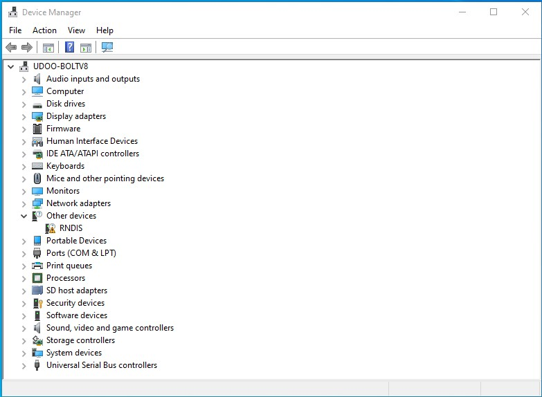
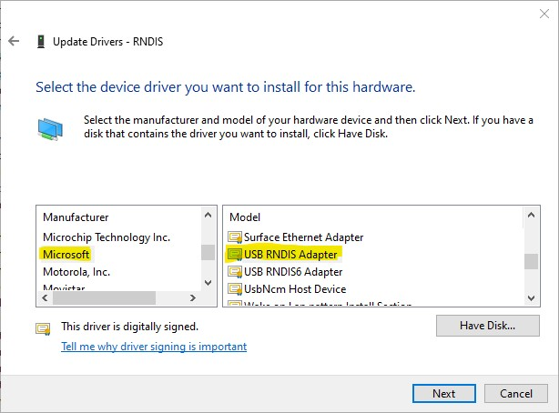
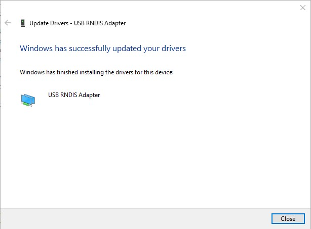
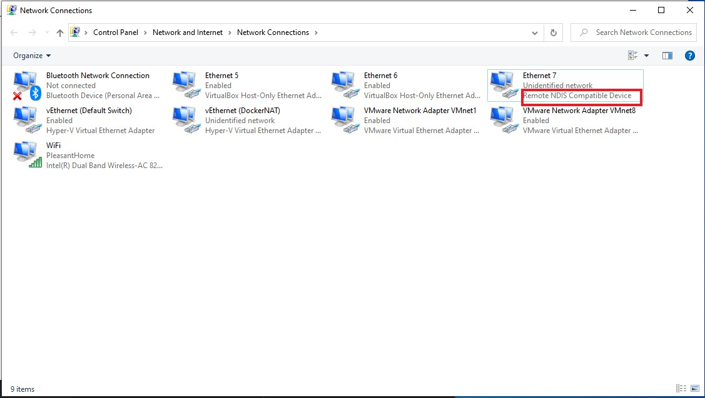
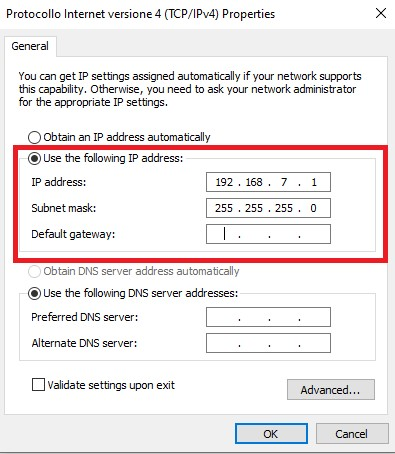

# SSH connection tutorial

## Linux
- Before to connect the UDOO NEO through the USB cable open a terminal on your Linux
- run the command `ifconfig` to check the network interfaces already present
- Connect now the UDOO NEO through the USB cable
- run again the `ifconfig` command in the terminal and note the name of the new interface that is added on the bottom of the output of the command (should be something similar to *usb0*, *ensN* or *enpXsY*)
- assign `192.168.7.1` as IP address to the new network interface:  
  `ifconfig <name_of_the_new_interface> 192.168.7.1 up`
  (e.g `ifconfig enp1s2 192.168.7.1`)
- You can now check the connection with a ping to the UDOO NEO address: `ping 192.172.7.2`

## MAC OSx

- Before to connect the UDOO NEO through the USB cable open a terminal on your MAC
- run the command `ifconfig` to check the network interfaces already present
- Connect now the UDOO NEO through the USB cable
- run again the `ifconfig` command in the terminal and note the name of the new interface that is added on the bottom of the output of the command (should be something similar to *enN*)
- assign `192.168.7.1` as IP address to the new network interface:  
    `ifconfig <name_of_the_new_interface> 192.168.7.1 up`
    (e.g `ifconfig en6 192.168.7.1 up`)
- You can now check the connection with a ping to the UDOO NEO address: `ping 192.172.7.2`

## Windows

- Connect UDOO NEO via Micro USB Cable to PC, eventually you'll get the following message:

 

- Right click on **Windows Start** and select **Device Manager**. It will show a list of devices currently connected with the development PC. In the list, *RNDIS* can be seen with an exclamation warning mark implying that driver has not been installed.

 

- Right click on it and select **Update driver**. When prompted to choose how to search for device driver software, choose **Browse my computer for driver software**.

- Browse for driver software on your computer will come up. Select **Let me pick from a list of device drivers on my computer** on the bottom of the window.

- A window will come up asking to select the device type. Select **Network adapters**, as RNDIS emulates a network connection.

 

- In the **Select Network Adapter** window, select **Microsoft** from the Manufacturer list on the left. Under the list of Network Adapter on the right, select **USB RNDIS Adapter**.

 

- The **RNDIS** device is now installed and ready for use.

 

- Now you need to configure the IP Address of the network created.  
Go to **Start** -> **Settings** -> **Network & Internet** and click on **Change adapter options** on the middle of the page. The Network Connections page appears with the list of your network adapters.
 

- Right-click the new connection adapters appeared and select **Properties**. Select the **Internet Protocol Version 4(TCP/IPv4)** and **Properties**.

- Select **Use the following IP address** and set
  * IP address: `192.168.7.1`
  * Subnet mask: `255.255.255.0`  
 

- Save the options and you can now check the connection with a ping to the UDOO NEO address: `ping 192.172.7.2`
